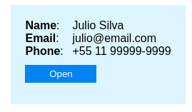

# js-json-as-card
Show JSON as Card Component

### How to use

```js

    const user = {
            email: 'julio@email.com',
            name: 'Julio Silva',
            phone: '+55 11 99999-9999'
        }

    <CardJson json={user}/>
```


```js

    const user = {
            email: 'julio@email.com',
            name: 'Julio Silva',
            phone: '+55 11 99999-9999'
        }

    <CardJson {...args} 
        id="user"
        styleCard={{
            backgroundColor: "#E1F5FE", 
            fontFamily: "Arial, sans-serif",
            borderRadius: 0,
            boxShadow: 'none'
        }} 
        styleLabel={{
            width: '50px',
            border: '1px'
        }}
        styleText={{
            marginLeft: '1rem'
        }}
        format={true}
    />
```

