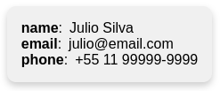

# js-json-as-card
Show JSON as Card Component

| Field              | Type         | Required | Default        | Description                                                                          |
| ------------------ | ------------ | -------- | -------------- | ------------------------------------------------------------------------------------ |
| id                 | string       | no       | undefined      | Id of the HTML component.                                                            |
| json               | object       | yes      | N/A            | JSON for presentation.                                                               |
| format             | boolean      | no       | false          | Format label like `name` => `Name` or `primary_email` => `Primary email`.            |
| styleCard          | object       | no       | N/A            | Object style for the card.                                                           |
| styleLabel         | object       | no       | N/A            | Object style for the labels.                                                         |
| styleText          | object       | no       | N/A            | Object style for the text.                                                           |


### Example

```js

    const user = {
            name: 'Julio Silva',
            email: 'julio@email.com',
            phone: '+55 11 99999-9999'
        }

    <CardJson json={user}/>
```



```js

    const user = {
            name: 'Julio Silva',
            email: 'julio@email.com',
            phone: '+55 11 99999-9999'
        }

    <CardJson {...args} 
        id="user"
        styleCard={{
            backgroundColor: "#E1F5FE", 
            fontFamily: "Arial, sans-serif",
            borderRadius: 0,
            boxShadow: 'none'
        }} 
        styleLabel={{
            width: '50px',
            border: '1px'
        }}
        styleText={{
            marginLeft: '1rem'
        }}
        format={true}
    />
```


```js

    const user = {
            "Name": 'Julio Silva',
            "E-mail": 'julio@email.com',
            "Phone": '+55 11 99999-9999'
        }

    <CardJson json={user}/>
```

